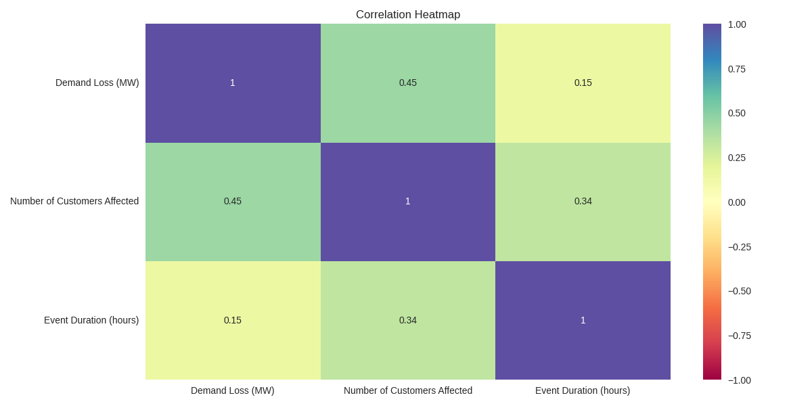
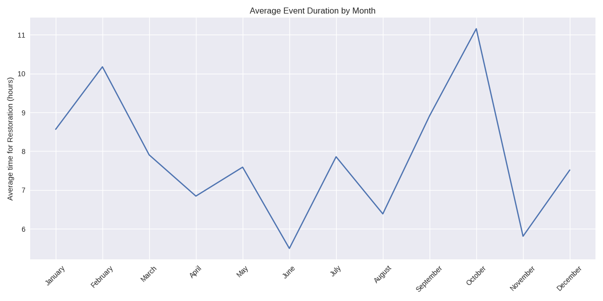

# US Electricity Disturbances Analysis (2019 - 2023)

## Overview
This repository contains two Jupyter notebooks focusing on the analysis of US electricity disturbances from 2019 to 2023. The data is sourced from the [US Department of Energy](https://www.oe.netl.doe.gov/OE417_annual_summary.aspx). The first notebook focuses on data cleaning, while the second notebook performs exploratory data analysis (EDA) to uncover insights and patterns in the data.

## Data Source
The dataset used in this analysis is obtained from the [US Department of Energy](https://www.oe.netl.doe.gov/OE417_annual_summary.aspx). The data includes information on electrical disturbances reported across the US from 2019 to 2023, including the causes, locations, and impacts of these disturbances.

## Project Structure
- `content`: Folder containing the data and plots.
  - `Data`: Contains the raw data files from the source in excel along with some documentation.
  - `Plots`: Contains all the plots saved from the analysis.
  - `electricity_disturbance_data.csv`: Combined data after data cleaning and preparation.
- `Data_Cleaning_US_Electricity_Disturbances.ipynb`: Jupyter notebook containing the data cleaning process.
- `EDA_US_Electricity_Disturbances.ipynb`: Jupyter notebook containing the exploratory data analysis.

## Notebooks

## 1. Data Cleaning
**File**: `Data_Cleaning_US_Electricity_Disturbances.ipynb`

This notebook outlines the process of cleaning the dataset to ensure it is ready for analysis. Key steps include:

- **Importing Necessary Libraries**: Libraries such as `pandas`, `numpy`, and others are imported to handle data operations and manipulations.
- **Loading the Dataset**: The raw dataset is loaded into a pandas DataFrame.
- **Standardizing Data Formats**: Ensuring consistency in data formats, such as dates and categorical variables.
- **Removing Duplicates**: Duplicate entries are identified and removed to avoid skewed results.
- **Ensuring Data Consistency**: Additional checks are performed to ensure data integrity and consistency.
- **Add or remove columns**: Add additional columns or remove existing columns based on the scope of the anlysis.
- **Save to CSV**: Saved the cleaned data frame to `electricity_disturbance_data.csv`

## 2. Exploratory Data Analysis (EDA)
**File**: `EDA_US_Electricity_Disturbances.ipynb`

This notebook provides a comprehensive analysis of the cleaned dataset to uncover trends, patterns, and insights. Key analyses include:

### **Initial Analysis**
- **Distribution**: 
  - **General Observations:**
    - **Skewness:** All three variables show a high degree of positive skewness, indicating that extreme values (high demand loss, many customers affected, and long event duration) are less frequent.
    - **Central Tendency:** The central tendency (mean or median) for all three variables is likely to be low due to the skewness.
    - **Variability:** There is a wide range in values for all three variables, suggesting a lot of variability in the impact of electrical disturbances.

- **Correlations**:
    
  - **Demand Loss (MW) and Number of Customers Affected:**
     - **Correlation Coefficient:** 0.45
     - **Interpretation:** There is a moderate positive correlation between demand loss (MW) and the number of customers affected. This suggests that as the demand loss increases, the number of customers affected tends to increase as well, but the **relationship is not very strong**.
   - **Number of Customers Affected and Event Duration (hours):**
     - **Correlation Coefficient:** 0.34
     - **Interpretation:** There is a moderate positive correlation between the number of customers affected and the event duration. This indicates that events affecting more customers tend to last longer, although the relationship is moderate and **other factors may also play a significant role**.
   - **Demand Loss (MW) and Event Duration (hours):**
     - **Correlation Coefficient:** 0.15
     - **Interpretation:** There is a weak positive correlation between demand loss (MW) and event duration. This suggests that the relationship between the amount of demand loss and the duration of the event is weak, implying that **factors other than the duration of the event are likely more significant** in determining the extent of demand loss.
 
      
### Event and Impact Analysis
  - **Question**: What is the most common type of event?
    - **Graph** 
    - **Most common type of event**: System Operations
    
  - **Question**: Which areas are most affected by these events?
    - **Graph**
    - 
    - **Most Affected Region**: California
      
  - **Question**: What is the average duration of each event type?
    - **Graph** 
    - **Observation**: Fuel-type emergencies on average take longer time to restore power.

### Demand and Customer Impact
  - **Question**: How many customers are affected by different types of events?
    - **Graph** 
    - **Observation** A large population of people is affected by Severe weather/weather-type events.
      
  - **Question**: Which Events have the greater average of Demand Loss (MW)?
    - **Graph** 
    - **Observation**: Fuel-type emergencies have a high average Demand loss (MW).
      

### Temporal Analysis
  - **Question**: Are there specific months with higher frequencies of events?
    - **Graph** 
    - **Observation**: The number of events over different months remains almost the same with small variations.
      
  - **Question**: Is there a trend in the number of events over the years?
    - **Graph** 
    - **Observation**: The analysis suggests that while there is a relationship between the Number of Events and Time, it is not strong, and most of the variation in the Number of Events is due to factors other than Time.
  
  - **Question**: How does the event duration vary over different months?
    - **Graph** 
    - **Observation**: The graph shows a peak during October, suggesting that weather plays a significant role in restoration times.

## License
This project is licensed under the MIT License.
